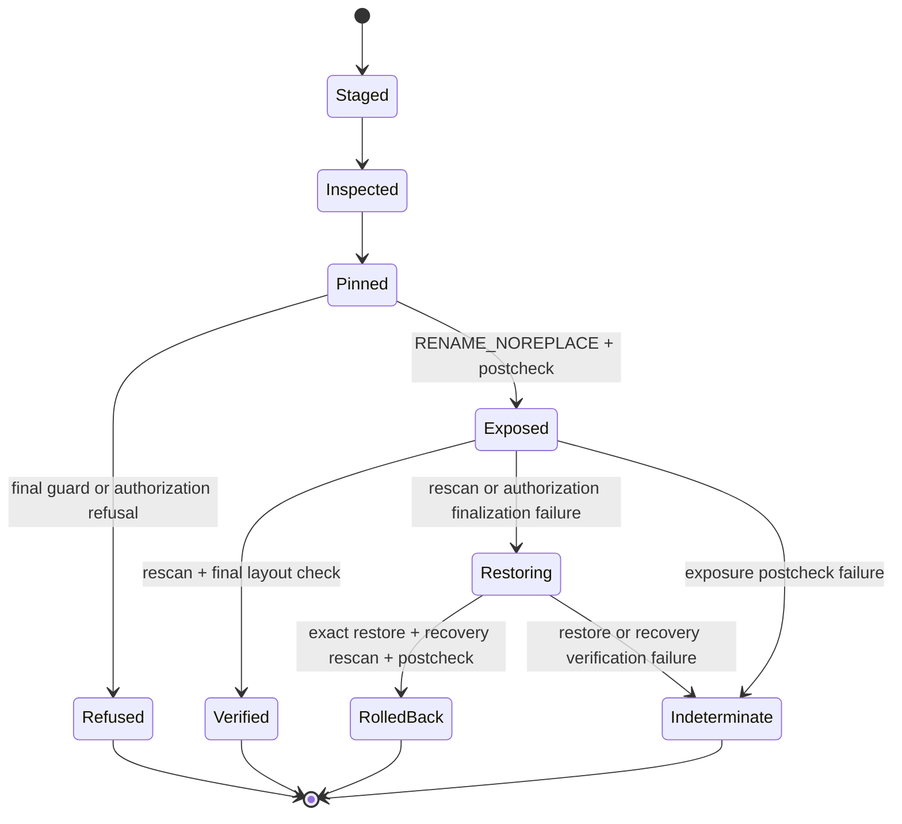
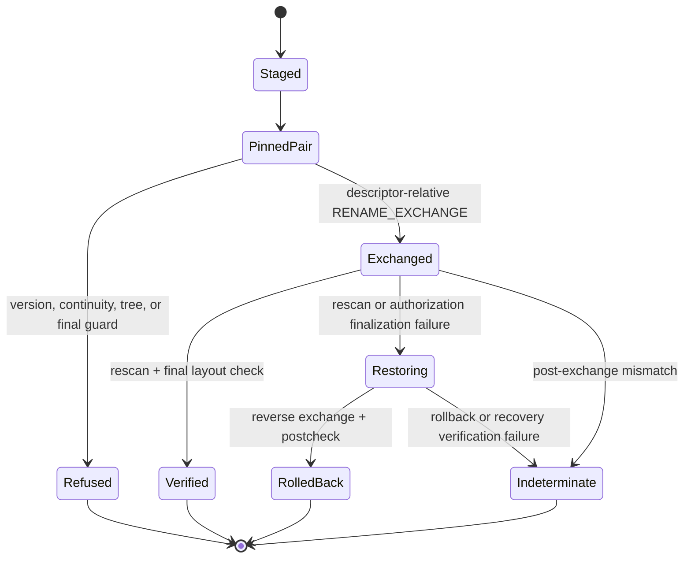
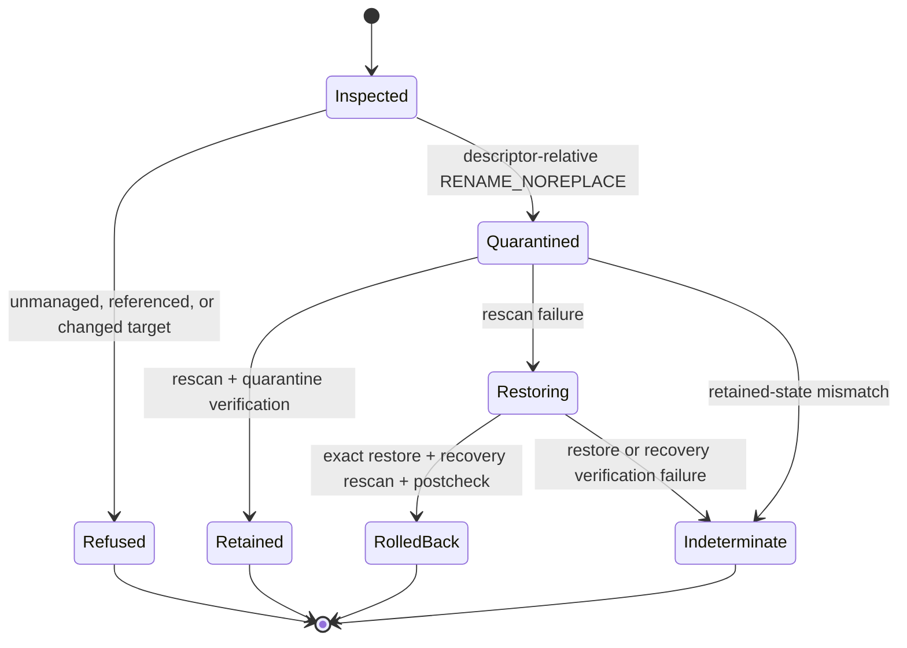

# Omarchy lifecycle module map

## Authority and boundary

This document is authoritative for ownership and review routing inside
`crates/a-quo-omarchy/src/install`. The behavioral and security contract,
including limitations and release non-claims, remains
[Signed Omarchy packages](OMARCHY.md). This decomposition is a reviewability
change; it is not new evidence of correctness, race freedom, crash durability,
safe purge, or Omarchy-coordinated enablement.

## Measured decomposition

Before this refactor, `install.rs` contained 5,084 lines. It is now a 97-line
public facade. No replacement lifecycle module exceeds 800 lines:

| Concern | Module | Lines after split |
| --- | --- | ---: |
| Public entry points | `install.rs` | 97 |
| Install orchestration | `install/operation/install.rs` | 527 |
| Update orchestration | `install/operation/update.rs` | 407 |
| Removal orchestration | `install/operation/remove.rs` | 179 |
| Fresh-install transaction | `install/operation/install_transaction.rs` | 730 |
| Update transaction | `install/operation/update_transaction.rs` | 492 |
| Removal transaction | `install/operation/remove_transaction.rs` | 439 |
| Pinned tree and identity checks | `install/tree.rs` | 697 |
| Update test seam (`cfg(test)`) | `install/update_test_seam.rs` | 89 |

Line counts are review aids, not quality or security evidence. Small support
modules own authorization, commands, package snapshots, receipts, persisted
references, staging boundaries, limits, and the install lifecycle seam.

Including the pre-existing 308-line `install/test_seam.rs`, the Rust source in
this lifecycle area grew from 5,392 to 5,610 lines (+218). This change is
therefore a compile-time responsibility decomposition, not a claim of total
code or conceptual-complexity reduction. The added source pays for explicit
module declarations, imports, visibility boundaries, and ownership seams; it
does not introduce a parallel orchestration layer.

The bounded update-seam follow-up leaves the necessary Linux orchestration as
one 273-line physical span (266 nonblank lines). It replaces four forwarding
test entry points and four generic closure parameters with one private
`UpdateLifecycle` callback interface and one `cfg(test)` builder. The install
module area grows by 28 lines for that explicit boundary, while the complete
Rust change, including simpler test construction, removes a net 43 lines. The
transaction sequence and its two operation-specific rollback classifications
remain deliberately linear; these measurements are reviewability evidence,
not evidence that the security state machine is smaller or correct.

## Dependency direction

```text
install.rs (facade)
├── operation/
│   ├── {install,update,remove}.rs
│   └── {install,update,remove}_transaction.rs ──> tree.rs
├── authorization.rs
├── command.rs
├── lifecycle.rs
├── {test_seam,update_test_seam}.rs (cfg(test))
├── package.rs
├── receipt.rs ──> tree.rs
├── reference.rs
├── staging.rs
└── tree.rs ──> limits.rs
```

Production operation modules compose mechanisms. Mechanism modules never call
back into the facade or an operation module. `test_seam.rs` and
`update_test_seam.rs` implement operation-specific contracts in
`lifecycle.rs`; they cannot replace verified identities, authorization
results, transaction state, or successful outcomes. `limits.rs` prevents a
receipt/tree dependency cycle by owning their shared immutable names and
bounds.

The boundary is enforced rather than diagram-only: transaction modules are
private children of `operation`, so sibling mechanisms such as
`authorization.rs` cannot name them; transaction modules import neither
command execution nor reference policy; and the fields of `PinnedInstall`,
`PinnedUpdate`, and `PinnedRemoval` are private to their owning modules.
Operations receive only generic authorization phases and narrow transaction
methods/results. A regression in any of those directions is a decomposition
failure even if file sizes remain small.

## Invariant ownership

| Invariant | Owner | Review entry points |
| --- | --- | --- |
| Lifecycle ordering, policy observations, and operation-specific failure classification | `operation/{install,update,remove}.rs` | `install_on_linux`, `update_with_lifecycle`, `uninstall_with_rescan_and_quarantine_hook` |
| One bounded package copy and Linux sealed snapshot | `package.rs` | `copy_package_once`, `snapshot_staged_package` |
| Publisher state and generic final authorization phase | `authorization.rs` | `publisher_persona_id`, `with_final_publisher_operation` |
| Root-owned command and descriptor-root validation | `command.rs` | `validate_system_command`, `run_validator_for_descriptor`, `run_rescan` |
| Receipt vocabulary, size, digest, version, and manifest agreement | `receipt.rs` | `write_install_receipt`, `validate_installed_state`, `require_newer_version` |
| Accepted persisted Omarchy reference source and exact-byte digest | `reference.rs` | `observe_plugin_reference`, `reject_stale_enabled_configuration`, `reject_referenced_removal` |
| Owner-private staging and missing/existing target boundaries | `staging.rs` | `retained_install_staging_directory`, `retained_update_staging_directory`, `require_existing_plugins_directory`, `reject_existing_target` |
| Device/inode identity, owner/mode/link/size/digest snapshots, same-filesystem checks, and descriptor/path revalidation | `tree.rs` | `target_identity`, `snapshot_update_tree_path`, `verify_update_tree_descriptor`, `verify_update_tree_path` |
| Fresh-install no-replace exposure and guarded restore | `operation/install_transaction.rs` | `prepare_pinned_install`, `expose_pinned_install_no_replace`, `rollback_pinned_install`, `verify_install_layout` |
| Update exchange, guarded rollback, and recovery description | `operation/update_transaction.rs` | `retain_and_exchange_update`, `rollback_pinned_update`, `verify_update_layout`, `describe_update_recovery_state` |
| Removal quarantine, guarded restore, and retained-quarantine verification | `operation/remove_transaction.rs` | `quarantine_pinned_target`, `restore_pinned_target`, `verify_retained_quarantine` |

Tests that directly challenge one mechanism live beside it. The public
hostile-lifecycle and receipt-contract tests remain in `src/lib.rs` and
`tests/` so they exercise the composed behavior rather than private
constructors alone.

## Lifecycle state transitions

### Fresh install



### Update



### Removal



## Failure and evidence matrix

| Boundary | Classified result | Preserved evidence/invariant | Representative regression test |
| --- | --- | --- | --- |
| Install final reference/authorization guard | refusal | candidate stays in retained private staging; no live overwrite | `final_install_configuration_guard_blocks_a_new_plugin_reference`; `final_install_authorization_guard_blocks_terminal_revocation_race` |
| Install candidate/parent changes before exposure | refusal or retained failure | recorded device/inode and tree snapshot; no recursive deletion | `install_refuses_a_substituted_candidate_without_deleting_either_tree`; `install_refuses_a_replaced_plugins_root_without_redirecting_exposure` |
| Install first rescan fails | rolled back or indeterminate | exact candidate is restored only after pinned identity/tree checks | `install_rolls_back_exact_candidate_when_shell_rescan_fails`; `install_rollback_never_overwrites_an_occupied_staging_slot` |
| Install post-exposure layout changes | indeterminate | false success is rejected; retained-state description is identity-bound | `install_reports_live_byte_mutation_after_exposure_instead_of_success` |
| Update pre-exchange checks fail | refusal or indeterminate | live installed tree remains and staged tree is not recursively removed | `update_refuses_in_place_installed_tree_mutation_before_exchange`; `update_refuses_a_substituted_candidate_before_exchange_without_deleting_it` |
| Update first rescan/finalization fails | rolled back or indeterminate | reverse exchange requires exact prior/candidate identities and snapshots | `update_rolls_back_exact_old_directory_when_rescan_fails`; `update_restores_prior_release_after_authorization_finalization_failure` |
| Update rollback is obstructed | rollback failure | exact prior release remains pinned and recovery location is described conservatively | `update_rollback_failure_retains_the_exact_prior_release`; `update_never_rolls_back_a_replacement_live_target` |
| Update post-rescan layout changes | indeterminate | false success is rejected after external-path and tree revalidation | `update_reports_a_post_rescan_live_swap_instead_of_success`; `update_reports_live_candidate_byte_mutation_as_indeterminate` |
| Removal final reference/identity guard fails | refusal | live target is unchanged | `final_uninstall_configuration_guard_blocks_a_new_plugin_reference`; `final_uninstall_identity_guard_preserves_both_paths_after_a_target_swap` |
| Removal rescan fails | rolled back or rollback failure | exact quarantined inode is restored only into an empty live slot | `uninstall_rolls_back_the_exact_directory_when_rescan_fails`; `uninstall_retains_quarantine_when_exact_restore_is_blocked` |
| Removal retained state changes | indeterminate | no purge runs; quarantine identity/path mismatch is reported | `uninstall_reports_a_renamed_quarantine_instead_of_a_false_success`; `uninstall_reports_relaxed_quarantine_permissions_as_indeterminate` |

## Review checklist

For a lifecycle change, review the operation transition first, then the one
mechanism module that owns the affected invariant, then the corresponding
failure-matrix regressions. A change that crosses module rows, adds a reverse
dependency, introduces a second seam for the same operation, changes a
serialized outcome, or weakens a device/inode/tree/path recheck requires
explicit security review.
